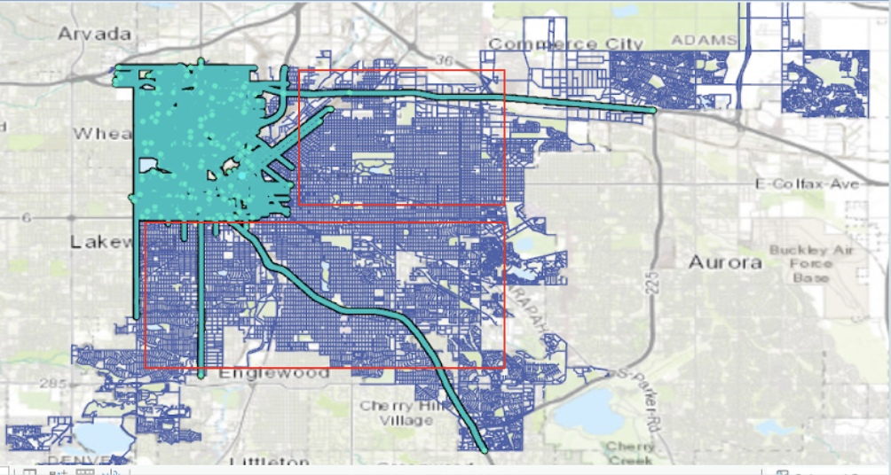

# AccessiPark
### W210 Capstone Project
by Rachael Burns, Richard Ryu, Michelle Sun, and Hong Yang 

## Missiong Statement
Reduce street-level accessibility problems and find accessible parking easily

## Data
* Used ArcGIS pro to extract all lat/long coordinates of downtown denver
* Leveraged Google Street API to download all images (~200k) associated with the coordinates from the extracted listed above

## Custom Labelling
* Used [labelImg](https://github.com/tzutalin/labelImg) to draw bounding boxes for 5 classes on 2500 images
lamp
sign-h
fire hydrants
no parking
stop sign

## Model Methodology
* Inspired by Roboflow's YOLOv5 notebook (link), we were able to implement YOLOv5 on our custom labelled images.

tt

## Website
