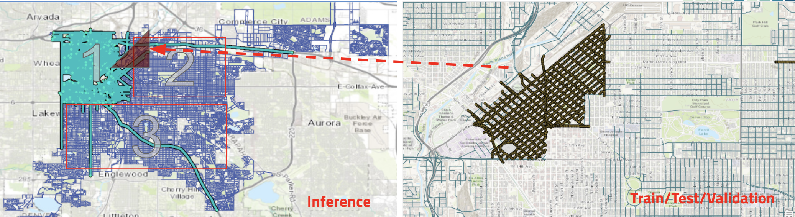
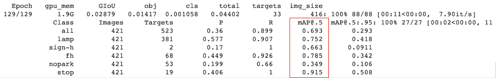

# AccessiPark
## W210 Capstone Project - Summer 2020
by Rachael Burns, Richard Ryu, Michelle Sun, and Hong Yang

## Problem Statement
**Problem 1: City streets are not always accessible.**
According to the 2010 US Census, there are 30.6 million Americans with physical disabilities. Nearly half use an assistive aid, such as a wheelchair (3.6 million) or a cane, crutches, or walker (11.6 million). Many streets, sidewalks, and businesses in the US remain inaccessible. Parking and sidewalk accessibility fundamentally affects where and how people live their lives, yet it is challenging for anyone to determine whether a given destination is accessible. The National Council of Disability and other organizations do not have comprehensive information on the degree to which sidewalks are accessible. Where partial information relevant to accessibility exists, there are few user-friendly solutions to deliver it to those who need it most. Methods available to organizations to assess accessibility, often in-person street audits or citizen call-in reports, are inconsistent and costly.
**Problem 2: Accessible parking is not easy to find.**
According to the Accessible Parking Coalition, 69% of people with disabilities have problems finding accessible parking in their communities. 96% say parking availability is important to leading an independent life. 70% say their decision to drive or ride is influenced by parking availablity. 62% say they would be more likely to drive or ride if parking was more available. 52% have decided not to make a trip because of concerns about finding parking.

## Mission and Vision Statement
Our mission is to help people identify accessible parking opportunities and avoid accessibility obstacles. 

Our vision is for people with mobility challenges to be able to lead fulfilling lives with peace of mind, armed with a plan for where to park and how to continue unobstructed to their destination.

## So what is this?
We're creating an [accessible parking map](http://ec2-54-183-149-77.us-west-1.compute.amazonaws.com:3001/) that displays handicap signs and obstacles that are detected through our custom trained YOLOv5 model that's inspired by [Roboflow's YOLOv5 notebook](https://blog.roboflow.ai/how-to-train-yolov5-on-a-custom-dataset/)

## How are we doing it?

### Data
* Used [ArcGIS](https://www.esri.com/en-us/arcgis/products/arcgis-pro/overview) pro to extract all lat/long coordinates of downtown Denver
* Leveraged Google Street API to download all images (~200k) associated with the coordinates from the extracted listed above



### Custom Labelling
* Used [labelImg](https://github.com/tzutalin/labelImg) to draw bounding boxes for 5 classes on 2500 images


### System architecture


### Model Methodology
* Inspired by [Roboflow's YOLOv5 notebook](https://blog.roboflow.ai/how-to-train-yolov5-on-a-custom-dataset/), we implemented YOLOv5 on our custom labelled images

* Applied **train** (70%) / **test** (30%) split on our dataset

* Leveraged [Google Colab](https://colab.research.google.com/github/tensorflow/examples/blob/master/courses/udacity_intro_to_tensorflow_for_deep_learning/l01c01_introduction_to_colab_and_python.ipynb) and [TensorFlow](https://www.tensorflow.org/tutorials) for both training and inference

* **mean Average Precision (mAP)** was used for model evaluation


* We won't go into much detail about YOLOv5 since this page is intended to explain how we were able to come up with AccessiPark map. For more information about YOLOv5, please visit [Roboflow's YOLOv5 blog](https://blog.roboflow.ai/yolov5-improvements-and-evaluation/)

* For inference, we used YOLOv5 pre-trained weights to detect 5 objects on ~200,000 images of downtown Denver


### Feature Engineering


The bounding boxes from the inference above are saved in a csv format. Above is an example of the csv file in pandas DF. In order to plot this on our AccessiPark map, we've listed the necessary feature engineering below:

* Transformation
  * Split 'imgname' into 'lat', 'long', 'angle'

  * Use googlemaps reverse_geocode API to search for the corresponding zipcode for each coordinate pairs

```
# You will need an active googlemaps API code
# david = pd.DataFrame(columns=['new_lat', 'new_long'])

import googlemaps
gmaps = googlemaps.Client(key = 'your API key')

for i in list(range(len(david))):
    temp_result = gmaps.reverse_geocode((david.loc[i,'new_lat'], david.loc[i, 'new_long']), result_type = "postal_code")
    david.loc[i, 'zipcode'] = temp_result[0].get('address_components')[0].get('long_name')
```

  * Use 'xcenter' of the bounding box to determine the relative location (left, right, center) of the detcted object, and then apply adjustment based on the cosine and sine transformation of the 'lat' and 'long'

```
def csv_par11(df, delta):
    for i in range(len(df)):
        df.loc[i, 'lat'] = float(df.loc[i, 'imgname'].split('-')[0])
        df.loc[i, 'long'] = float(df.loc[i, 'imgname'].split('-')[2]) * -1.0
        df.loc[i, 'angle'] = df.loc[i, 'imgname'].split('-')[3][:-4]

        if df.loc[i, 'xcenter'] <= 0.333333:
            df.loc[i, 'detect_loc'] = 'L'
            df.loc[i, 'new_lat'] = df.loc[i, 'lat'] + (delta * math.cos((math.pi / 180)*(float(df.loc[i, 'angle'])-90)))
            df.loc[i, 'new_long'] = df.loc[i, 'long'] + (delta * math.sin((math.pi / 180)*(float(df.loc[i, 'angle'])-90)))
        elif df.loc[i, 'xcenter'] > 0.666666:
            df.loc[i, 'detect_loc'] = 'R'
            df.loc[i, 'new_lat'] = df.loc[i, 'lat'] - (delta * math.cos((math.pi / 180)*(float(df.loc[i, 'angle']) -90)))
            df.loc[i, 'new_long'] = df.loc[i, 'long'] - (delta * math.sin((math.pi / 180)*(float(df.loc[i, 'angle']) -90)))
        else:
            df.loc[i, 'detect_loc'] = 'C'
            df.loc[i, 'new_lat'] = df.loc[i, 'lat']
            df.loc[i, 'new_long'] = df.loc[i, 'long']
    return df
```

* Organize inferences into CSV file by zipcodes

```
def zip_df(df):
    for i in df["zipcode"].unique():
        temp_df = df[df["zipcode"] == i]
        temp_df.to_csv(i + '.csv', encoding = 'utf-8', index = False)
```

  * For full process from start to finish, please refer to the [ETL notebook](https://github.com/sunh0003/W210Capstone-AccessibleParkingMap/blob/master/ETL/google_reverse_geocode.ipynb)

### AccessiPark Map

* 2 Docker Containers
  - Middleware - [Flask](https://flask.palletsprojects.com/en/1.1.x/)
  - Frontend - [React](https://reactjs.org/)

* [Base Web React UI Framework](https://baseweb.design/)

* [icons for objects](https://icons8.com/)


Come check it out at [AccessiPark](http://accessipark.com)
